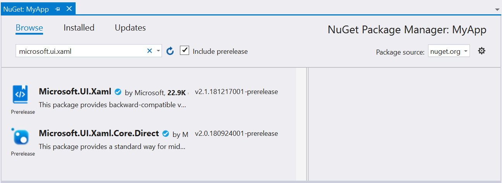

# Windows UI Library NuGet Packages

NuGet is a standard package manager for .Net applications that is built into Visual Studio. From your open solution choose the *Tools* menu, *NuGet Package Manager*, *Manage NuGet packages for solution...* to open the UI.  Enter one of the package names below to search for it online.

| NuGet Package Name | Description |
| --- | --- |
| Microsoft.UI.Xaml.Controls | Controls for UWP apps |
| Microsoft.UI.Xaml.Core.Direct  | Enables you to use [XamlDirect] (/uwp/api/microsoft.ui.xaml.core.direct.xamldirect) APIs on earlier versions of Windows 10 without needing to write special code to handle multiple target Windows 10 versions. |

## Search in Visual Studio

Searching in Visual Studio package manager you should see a list similar to this one (version numbers may be different, but names should be the same).

## Update Nuget Packages

We regularly update the Windows UI Library with new controls, services, APIs, and more importantly, bug fixes. To make sure you are on the latest version, open your project in Visual Studio, choose the **Tools** menu, select **NuGet Package Manager** -> **Manage NuGet Packages for Solution...** and select the *Updates* tab. Select the package you want to update and click Instal to update to the latest version.

## Getting Started

Read the [getting Started with the Windows UI Library](getting-started.md) for more instructions on using these NuGet Packages in your own projects. 
